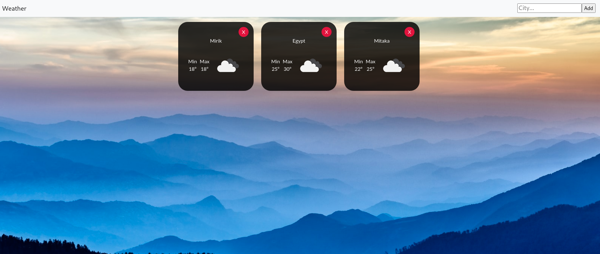

### ☀🌧⚡ API WEATHER ⚡🌧☀

- Created with React.js, using [OpenWeather APi][1] , React Hooks, and Fetch

**Preview**

### Installation

-Clone the repository

-To install and run this proyect just type and execute

`npm install`

-Start the proyect with

`npm start`

👩‍💻

[1]: https://openweathermap.org/current "OpenWeather API"